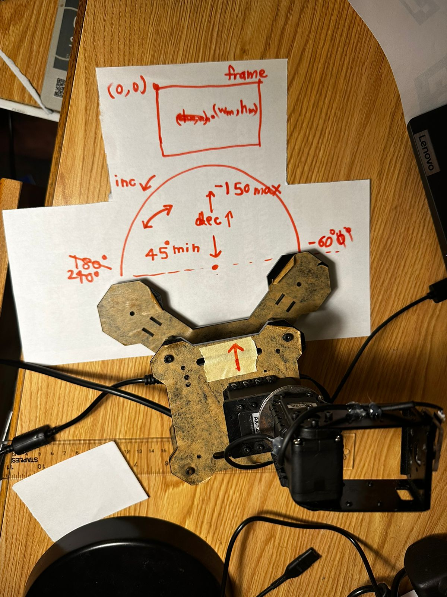
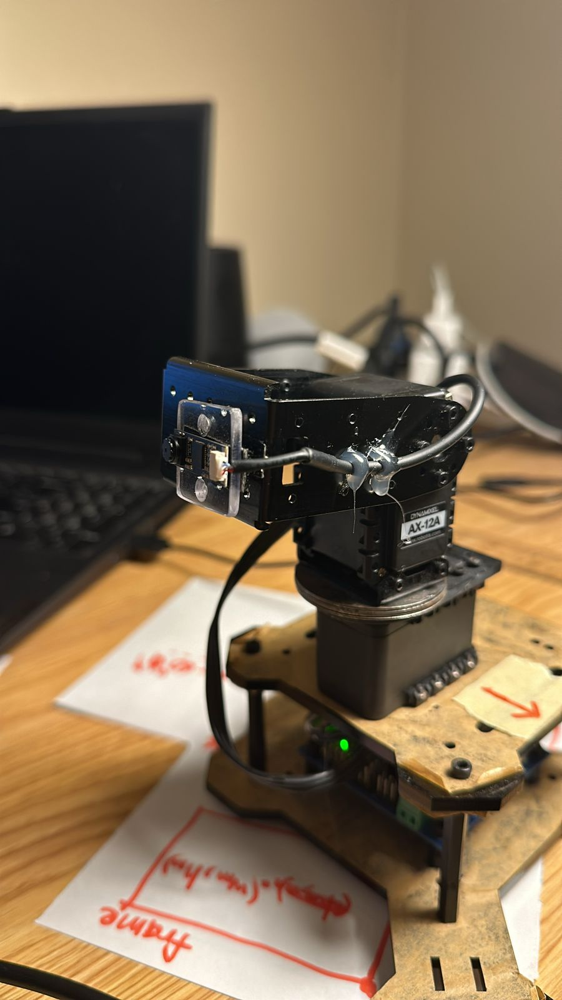
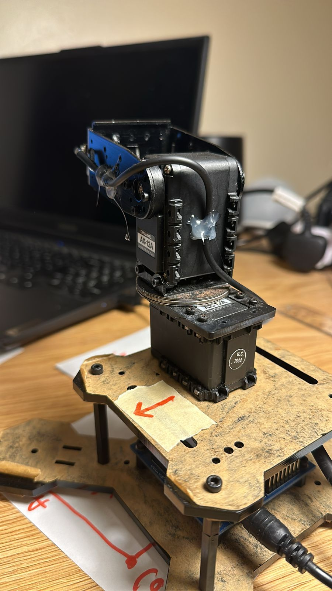

**Project: Drone Tracking Robot Arm**

**Goal:**
A drone tracking robot arm. The physical arm will be constructed using the AX-12A servos, "Trossen" robot package. 
Computer vision will be used to track the movement of a drone with onboard aruco tags, and the arm will reposition itself so that it is pointing towards the drone. 

**Impact**
This will augment the human ability to record video footage of fast moving objects from one place to another, thereby improving safety and efficiency in many industrial scenarios and beyond. 

**SETUP**

**software setup**
Software: -Oracle VirtualBox VM running on Windows 11 PC -Virtual machine: -Ububtu 20.04 -running ROS noetic

Hardware: -Arbotix pincher arm -Dynamixel servo motors -Arbotix board -FTDI cable connected to PC via USB

Step 1: Set up VM to read USB port -Open Oracle VM virtualbox -Click on your virtual machine -Click settings -Click USB on the left sidebar -Make sure enable USB controller and USB 2.0 are selected. -Select the second icon on the right toolbar (add USB icon) -Select FTDI -start the VM, open a terminal, and type lsusb. You should notice the FTDI there.

Step 2: Follow the following tutorial till [4:31]: https://www.youtube.com/watch?v=ebscKnr9jN0

NOTE: -sometimes all the motors may not respond when you type "ls" in arbotix terminal. In this case, unplug one (or both) of motor commectors from the arbotix board and plug them back in. -tutorial references files "arm.yaml" and "arm.launch" aka "arbotixarm.launch" which are provided in the this repo. -tutorial references an already created package. Create your own and catkin_make before you run it.

CAMERA

By default, your VM may not be recognizing your system's webcam, which may prevent you from launching the camera using openCV, even for testing.

If using Virtual Box: -You need to download the extension pack that can be found on this link: https://www.virtualbox.org/wiki/Downloads Scroll down to "VirtualBox 7.0.16 Oracle VM VirtualBox Extension Pack" and click on "all supported platforms". The pack will be installed when you click on it. -Make sure you are NOT using the USB camera/webcam in your host machine. -Once it is fully installed, close VirtualBox and start your VM.
-From the top right toolbar, select Devices, and then webcam. -Here, you can either select the webcam you have, or a USB cam.

Placing the package:
Download the arbotix_test package and place it in:
```
~/catkin_ws/src
```

then build the package
```
catkin_make
```


**hardware setup**

The servo limits were found and are shown below in degrees. You may need to find new limits for different configurations. Use the arm_controller.py script 
from arbotix_test/src to test out random pan and tilt angles.



-The arrow shows the orientation of the robot.
-The rectangle depicts a single frame in the video stream of the webcam.

The wires of the webcam are hot glued onto the servos as shown below




**STEPS**

1) check if your servos are working. Open a new linux terminal and type
```
arbotix_terminal
ls
```

The IDs of the servos connected to your arbotix chip should start popping up. If they don't, turn the servo power on and off and try again.


2) Start up the arm using the arm.launch file
```
roslaunch arbotix_test arm.launch
```
  
4) Open a new terminal. Now start the aruco tag tracking. 
```
rosrun arbotix_test detect_aruco_video.py --type DICT_5X5_100 --camera True
```
here, we are tracking aruco tags of type DICT_5X5_100. 

5) Open another terminal and type:
```
rosrun arbotix_test arm_controller_v3.py
```


A pop up window should display the video stream and aruco tag coordinates
